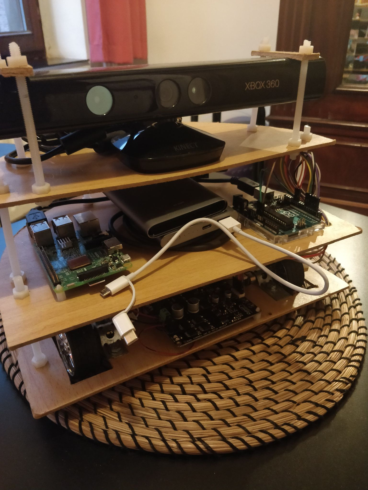
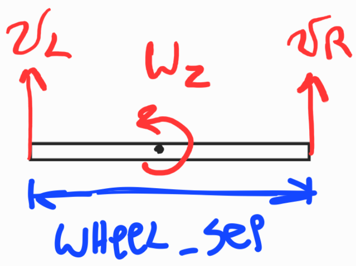
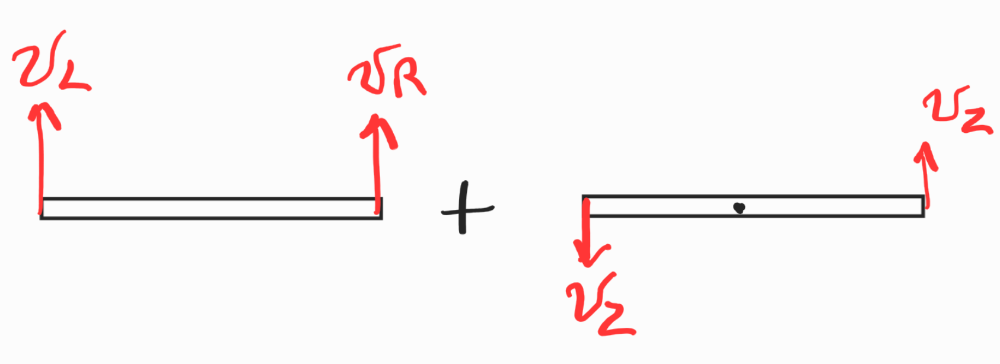
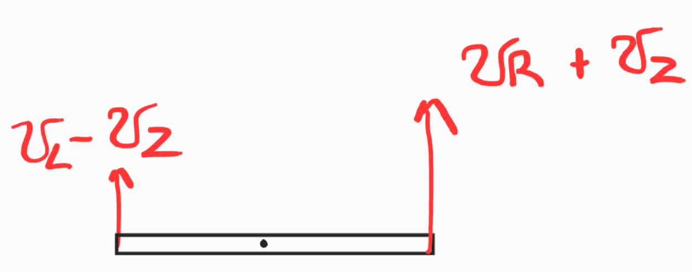
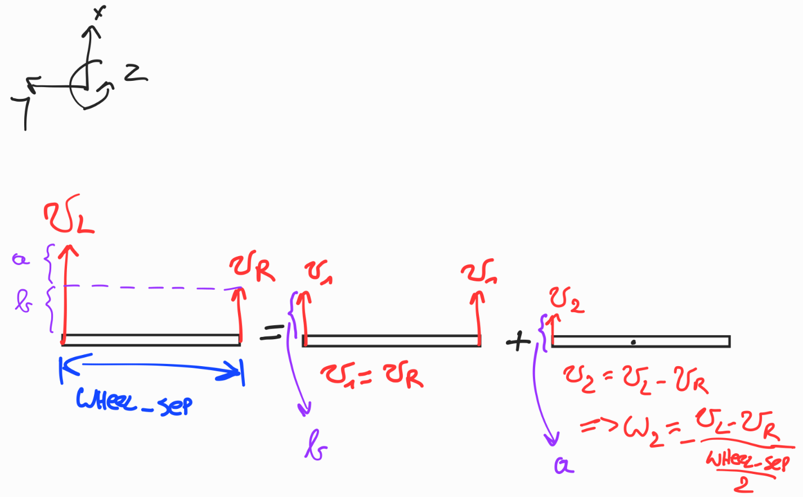

# Table of Contents
* [Introduction](#introduction)
* [Software used](#software-used)
* [Hardware used](#hardware-used)
  * [Parts](#parts)
* [Robot design](#robot-design)
* [Installing the software](#installing-the-software)
* [Controlling the motors](#controlling-the-motors)
  * [Arduino code for controlling the motors](#arduino-code-for-controlling-the-motors)
  * [Testing Arduino code](#testing-arduino-code)
  *  [Launch file](#launch-file)
* [Reading motor encoders](#reading-motor-encoders)
  * [Arduino code for reading motor encoders](#arduino-code-for-reading-motor-encoders)
* [Navigation stack](#navigation-stack)
  * [Odometry source node](#odometry-source-node) 
    * [Calculating the pose from odometry](#calculating-the-pose-from-odometry)  
      * [Python code snippet](#python-code-snippet)  
    * [Calculating the twist from odometry](#calculating-the-twist-from-odometry)
    * [Publishing odometry information](#publishing-odometry-information)
  * [Creating our robot package](#creating-our-robot-package)
    * [Robot configuration launch file](#robot-configuration-launch-file)
    * [Costmap configuation files](#costmap-configuation-files)
      * [Common configuration](#common-configuration) 
      * [Global costmap configuration](#global-costmap-configuration)
      * [Local costmap configuration](#local-costmap-configuration)
    * [Base Local Planner configuration](#base-local-planner-configuration)
    * [AMCL configuration](#AMCL-configuration)
    * [Navigation stack launch file](#navigation-stack-launch-file)
* [Creating a map](#creating-a-map)
* [Sending navigation goals to our robot](#Sending-navigation-goals-to-our-robot)

# Introduction
This project came about because of the COVID-19 pandemic. In normal times I would have had the opportunity to work with the turtlebot3 for one of the courses I am enrolled in.

Since we were not allowed to have hands-on exercise sessions and sending every student a turtlebot3 was not possible, the exercise sessions mainly consisted of completing partially written code in Python. I should note however that the goal of the exercise session was not to learn how to write code for a robot, but to have a firmer grasp on the concepts from the lectures (e.g. the Kalman filter and different path planning algorithms). 

While the exercise sessions succeeded in this area, I was still itching to learn how to write code for a robot and to see this code in action. Throughout the semester I started my research on what was needed to make a turtlebot3-like robot and devised a sort of action plan. After my exams I finally started this project.

Tasks:
- [x] Setting up ROS on rpi and laptop.
- [x] Installing RTABMAP ros.
- [x] Testing RTABMAP ros. 
- [x] Writing code for controlling the motors.
- [x] Testing the code for controlling the motors.
- [x] Writing code to read encoder data.
- [x] Testing reading encoder data code.
- [x] Writing code to calculate pose from the encoder data
- [x] Writing code to publish the pose and twist in a `nav_msgs/Odometry` message format.
- [x] Testing publishing of `nav_msgs/Odometry` message code
- [x] Write code to calculate twist frrom encoder data
- [x] Create static transform between base_link and base_laser (base_laser will be camera_link from freenect).
- [ ] ~~Figure out how to integrate rospy.Rate() into odometry publisher (= odometry_handler.py).~~
      --> needed to use classes to achieve this
- [x] Write code for 'OdometryHandler' class
- [x] Test code for 'OdometryHandler' class
- [x] let arduino continuously publish encoder data
- [x] See if we can run everything we need for gmapping 
- [x] Configure RTABMAP ROS
- [x] Testrun

# Software used

 - [Ubuntu 18.04.5 LTS](https://releases.ubuntu.com/18.04/) for the laptop
 - [Ubuntu 18.04.5 LTS server](https://cdimage.ubuntu.com/releases/18.04/release/) (from a preinstalled server image) for the Raspberry Pi
 - [ROS melodic](http://wiki.ros.org/melodic)
 - [Arduino IDE](https://www.arduino.cc/en/software)

# Hardware used

 - A laptop
 - Raspberry Pi 3B+ (from now on referred to as RPI)
 - Arduino Uno Rev3
 - Microsoft xbox 360 Kinect (model 1414) + power adapter
 - Cytron MDD10A DC motor drive
 - Pololu 380:1 micro metal gearmotor HPCB 12V with extended motor shaft
 - Pololu 12CPR magnetic encoder kit
 - Pololu 1/2" metal ball caster
 - Xiaomi 10000 mAh powerbank
 - 12 V battery holder

## Parts

 - Various nuts and bolts
 - Plastic 6mm threaded rod
 - Plasting M6 nuts
 - 3mm and 6mm mdf plates

# Robot design
The design was inspired by the turtlebot3 burger. The robot has three layers. The first layer (on the bottom) is for the two motors with encoders, the battery pack for the motors and the motor drive. The second, middle, layer is for the raspberry pi, the arduino and the battery pack for the arduino as well as for the kinect. The third layer is for the kinect camera itself.

A render of the robot can be seen below. The technical drawings can be found in the `CAD files and technical drawings` folder.


and this is what it currently looks like in real life:



It's not the prettiest of things, but it works for now. I will tidy up the wiring at a later time and maybe I'll also lasercut the mdf plates instead of using the ones I cut myself.


*sources:*
 - *[Arduino](https://grabcad.com/library/arduino-uno-r3-1)*
 - *[Raspberry PI](https://grabcad.com/library/raspberry-pi-3-b-1)*
 - *[Motor](https://www.pololu.com/product/4799/resources)*
 - *[Encoder](https://www.pololu.com/product/4760/resources)*
 - *[Kinect](https://grabcad.com/library/kinect-xbox-360)*
 - *[Motor drive](https://www.cytron.io/p-10amp-5v-30v-dc-motor-driver-2-channels)*
 - *[Metal ball caster](https://www.pololu.com/product/953/resources)*

# Installing the software
Information on how to install the software we will be using can be found in the [wiki](https://github.com/ongaroleandro/autonomous-mobile-robot/wiki/Installing-the-software).

# Controlling the motors
The desired linear and angular velocities are sent in the form of `geometry_msgs/Twist` messages. In theory these messages can be published on any topic name but usually they are published on the `/cmd_vel` topic. We will also publish them on the `/cmd_vel` topic. Why that is becomes clear when we are setting up the navigation stack.

## Arduino code for controlling the motors
See the full code [here](https://github.com/ongaroleandro/autonomous-mobile-robot/blob/main/Arduino/motor-control-and-reading-encoder.ino). The code has many comments, so it should be easy to follow. That is why I'm only going to explain how we convert the `geometry_msgs/Twist` message into something our motor driver can understand. 

Looking at the [API](http://docs.ros.org/en/melodic/api/geometry_msgs/html/msg/Twist.html) of the `geometry_msgs/Twist` message we can see that it contains two vectors; one for linear velocities and one for angular velocities. We're only interested in the linear velocity in the x-direction and the angular velocity in the z-direction. By only sending a linear velocity in the x-direction to the robot, it will move forwards or backwards. (positive velocity is forwards, negative is backwards) By only sending an angular velocity the robot will rotate in place in either the clockwise or counterclockwise direction. (positive angular velocity is counterclockwise and negative is clockwise) By sending a combination of a linear and angular velocity, the robot can follow a curved path.

Alright, let's look at the code for converting the `Twist` message into something the motor driver can understand. It only takes seven lines of code:
```cpp
void messageCb( const geometry_msgs::Twist& msg){
  speed_ang = msg.angular.z;
  speed_lin = msg.linear.x;
  w_r = ((speed_lin/wheel_rad) + ((speed_ang*wheel_sep)/(2.0*wheel_rad)));
  w_l = ((speed_lin/wheel_rad) - ((speed_ang*wheel_sep)/(2.0*wheel_rad)));
  dw_r = 33.55*w_r;  //dw_r is w_r transformed into motor driver value. motor driver (0 to 255)
  dw_l = 33.55*w_l;
}
```
Above you can see the function which is called each time we receive a `Twist` message on the `/cmd_vel` topic.

```cpp
  speed_ang = msg.angular.z;
  speed_lin = msg.linear.x;
```
Here we extract the angular velocity in the z-direction and linear velocity in the x-direction from the `Twist` message and assign it to `speed_ang` and `speed_lin` variables.

```cpp
  w_r = ((speed_lin/wheel_rad) + ((speed_ang*wheel_sep)/(2.0*wheel_rad)));
  w_l = ((speed_lin/wheel_rad) - ((speed_ang*wheel_sep)/(2.0*wheel_rad)));
```
Here we calculate the angular velocity of the left and right wheel. This is the angular velocity of the wheels, so this is the angular velocity of the gearbox shaft, not the motorshaft. How we get these formulas is pretty straightforward. Let's look at the case where we send a positive linear velocity v (= v_L = v_R) and an angular velocity ω_z. We can draw this situation as follows:



The black rectangle is the axle connecting both motors. Using superposition we can see separate the linear and angular velocities. We also know `v = r * ω`, so the angular velocity ω_z can be represented as two linear velocities in opposite directions. So we get:



Here is `v_z = ω_z * (wheel_sep / 2)`. Using superposition again we get:



So we can see the linear velocity of the left wheel is equal to `v_L - v_z` and the linear velocity of the right wheel is equal to `v_R + v_z`. To convert these linear velocites to angular velocities, we divide by the radius of the wheels `wheel_rad`. We also say that in this situation the angular velocites of the wheels are positive and that the left wheel is rotating in the clockwise direction and the right wheel in the counterclockwise direction (when looking straight at the wheel).

Okay, so now we have the angular velocites of the wheels. The next step would be to multiply this with the gearbox ratio (380 in our case) to get the angular velocity of the motor shaft. We don't need to this however because the manufacturer of our motor gives us the torque-speed characteristic at the output shaft of the gearbox. Why we need the torque-speed charactersitic will become clear soon.

```cpp
  dw_r = 33.55*w_r;  //dw_r is w_r transformed into motor driver value. motor driver (0 to 255)
  dw_l = 33.55*w_l;
```
Here we convert the angular velocities to a value the motor driver can understand. What can our motor understand? Our motor driver has four inputs, two for each motor. By supplying one input with a number between 0 and 255 we can vary the duty cycle of that motor between 0% and 100%. A duty cycle of 100% rotates the motor at full speed, and a 0% duty cycle makes the motor not rotate at all. By supplying a HIGH or LOW to the other input, we can specify in which direction the motor should turn. Which direction HIGH or LOW gives depends on how you have wired the motor terminals. In my case sending HIGH rotates the motors in a counterclockwise direction and thus LOW is the clockwise direction.

Now you may have noticed that dw_l and/or dw_r become negative when w_l and/or w_r are negative. Later on in the code (lines 116 to 156) you can see that we check if dw_l and/or dw_r are negative. If they're negative we take the absolute value. But, the negative value means something; the negative value means the direction should be reversed. Earlier we said a positive angular velocity of the left wheel means it is rotating in the clockwise direction, so a negative angular velocity means the left wheel should rotate in the counterclockwise direction.

Now for the explantion of the `33.55`. There is a linear relationship between the duty cycle and the speed of the motor, so the `33.55` is just the gradient of this relationship. We can calculate the gradient by defining two points. One point is (0, 0), where the first zero is the speed of the motor and the second zero is the duty cycle. The second point is (maximum motor speed, 255), because at 100% duty cylce the motor will run at full speed. There are two ways to get maxium motor speed.

  1. Using the torque-speed characteristic. By estimating how much torque the motors need to supply (at the gearbox side), we can see how fast the the output shaft of the gearbox will turn. This is will be the speed at 100% duty cycle.
  2. After implementing the encoders into our code. In the next section you'll see we use `teleop_twist_keyboard` to send `geometry_msgs/Twist` messages. By increasing the linear velocity we send we can get the maximum speed. Be sure to read the speed when the motors are under load. (so do not put the robot on a box so the wheels can rotate freely).

## Testing Arduino code
We'll use [teleop_twist_keyboard](http://wiki.ros.org/teleop_twist_keyboard), which converts key presses into `geometry_msgs/Twist` messages which then get published to the `/cmd_vel` topic.

We could test our code by running the following command

 1. Run `roscore`
 2. Run `rosrun rosserial_python serial_node.py /dev/ttyACM0` in a new terminal window.
 3. Run `rosrun teleop_twist_keyboard teleop_twist_keyboard.py` in a another new terminal window.

But to make our lives easier we're going to create a launch file. This way we'll only need to enter one command. You can find the launch file [here](https://github.com/ongaroleandro/autonomous-mobile-robot/blob/main/ROS/src/testing/src/teleop.launch)

## Launch file
The ros wiki has a [great](http://wiki.ros.org/ROS/Tutorials/UsingRqtconsoleRoslaunch#Using_roslaunch) tutorial on making a launch file and luckily it is pretty straightforward. Our launch file will have to launch rosserial and teleop_twist_keyboard. The launch file is located at `ROS/src/testing/src/`.

# Reading motor encoders
The encoder I am using has 12 counts per revolution which is equal to 3 pulses per revolution of the encoder shaft. Since the motor has a 380:1 gearbox, this makes it 1140 pulses per revolution. 

To read the encoders I am using the encoder library from 1988Kramer, you can download the necessary files from [his github](https://github.com/1988kramer/motor_control). We will also need the [TimerOne](https://github.com/PaulStoffregen/TimerOne) library from Paul Stoffregen to get the encoder library to function correctly.

We will publish the angular velocity read by the encoders on the `/arduino_data` topic. The message type we send is a `Float32ArrayMultiArray`. You can find the API for this message type [here](http://docs.ros.org/en/melodic/api/std_msgs/html/msg/Float32MultiArray.html).

## Arduino code for reading motor encoders
The full code can be found [here](https://github.com/ongaroleandro/autonomous-mobile-robot/blob/main/Arduino/motor-control-and-reading-encoder.ino). Again, the code has many comments so I'll only explain some key points here.

```cpp
Encoder motor_encoderL(2, 4, deltaT, 2280);
Encoder motor_encoderR(3, 5, deltaT, 2280);
```
Here we create our two encoder objects, one for the left encoder and one for the right encoder. The encoder class needs 4 arguments; the pin on the arduino where the A phase of the encoder is connected, the pin on the arduino where the B phase of the encoder is connected, the time between `getSpeed` calls and the number of ticks per revolution.

  - Pins 2 and 5 have to be used, since the encoder library uses interrupts and these are the only pins on an Arduino UNO which are interrupt pins. For the left encoder I am using pin 2 and pin 3. For the right encoder I am using pin 3 and 5. In my setup I needed to connect the A phase of the left encoder to pin 2, the B phase of the left encoder to pin 4, the A phase of the right encoder to pin 5 and the B phase of the right encoder to pin 3 to get a postive speed reading from both encoders when the robot is moving forwards.

  - The deltaT defines how frequently, in microseconds, we call the `getSpeed` method of the encoder library. Previously in the code (line 34) we define deltaT as 50000, so 50 miliseconds. An important thing to note however is that the deltaT here is purely for the speed calculation. We use the TimerOne library to actually call the `getSpeed` method every 50ms. Another note, the `getSpeed` functions returns the speed in degrees/sec.

  - The ticks per revolution caused some headscratching. At first I thought this was just the amount of pulses per revolution, so 1140. This is not the case however because we're using an interrupt which detects a change in voltage of the pin. Since a pulse has a rising edge and a falling edge, there are two changes per pulse, meaning we need to enter 2280 to get a correct speed reading.

```cpp
 Timer1.initialize(deltaT);
 Timer1.attachInterrupt(readSpeed);
 attachInterrupt(0, read_motor_encoderL, CHANGE);
 attachInterrupt(1, read_motor_encoderR, CHANGE);
```
*The code above is located in the setup function of the Arduino.* With `Timer1.initialize(deltaT)` we create a timer of 50ms and with `Timer1.attachInterrupt(readSpeed)` we say that the method `readSpeed` needs to be executed each time the timer reaches 50ms.

We also attach an interrupt to pin 0 and function `read_motor_encoderL` and pin 1 and function `read_motor_encoderR`. The functions can be found on lines 158 to 164 in the full code.

```cpp
 int sec = nh.now().sec % 10000;  //this works
 double nsec = nh.now().nsec / 100000;
 double nsec2 = nsec / 10000;
 
 array_msg.data[0] = Lspeed;
 array_msg.data[1] = Rspeed;
 array_msg.data[2] = sec + nsec2;
 pub.publish(&array_msg); //publish message

```

*The code above is located in the loop function of the Arduino.* Sending the currect time with the current speed reading is done in a hacky way. Apparantly the number returned by `nh.now().toSect()`is too big for the arduino to handle so we split it up in the most absurd way possible. We take the last four digits of the second part with `nh.now().sec % 10000`. We then divide the nanoseconds part in two stages (because doing it in one go does not work, for some reason). Then we add them together and assign it to the third element of our array message with `array_msg.data[2] = sec + nsec2`.

# Navigation stack
The navigation stack is essential for our robot since this is what makes our robot mobile. The navigation stack is well documented on the ROS wiki, and there's even a [tutorial](http://wiki.ros.org/navigation/Tutorials/RobotSetup) on how to set up a navigation stack.

On that wiki page there is a handy image to give us an idea of the different components of the navigation stack. Note the blue boxes, these are the things we'll need to provide to the navigation stack. The bottom box `base controller`, should seem familiar because we already made this part in [Controlling the motors](#controlling-the-motors). 

The `sensor sources` node on the left will be provided by `freenect_stack`. The only node we need to create ourselves is the `odometry source` node. 

## Odometry source node

We will create a ROS package called `odometry` with the command `catkin_create_pkg odometry geometry_msgs nav_msgs std_msgs tf2 tf2_ros rospy roscpp`. The odometry source node publishes messages on the `odom` topic. This topic contains a `nav_msgs/Odometry` message. 

Looking at the [API](http://docs.ros.org/en/noetic/api/nav_msgs/html/msg/Odometry.html) of this message, we can see that it contains the pose and twist of our robot. The API also states that the pose is with respect to the frame specified in the header, while the twist is with repect to the child frame. According to [REP105](https://www.ros.org/reps/rep-0105.html), the header frame will be the odom frame and the child frame will be the base_link frame. The base_link moves with the robot while the odom frame is a fixed frame. At this point in time we'll assume the origin of the map frame and the origin of the  odom frame coincide and that our robot always starts at the origin of the odom frame.

With these assumptions we can determine the pose from our odometry, i.e. the two wheel encoders. 

We also want to publish at a rate of 20Hz while our arduino sends the encoder data at a much higher rate. We will be using classes to allow us to collect our arduino data and publish our messages at different rates. 

We will make three classes; a `DataProcessor` class which subscribes to `/arduino_data`, a `Publisher` class which publishes messages on the `odom` topic and finally a `OdometryHandler` class which will be used to bring the previous two classes together. Below you can see the UML class diagram.

![UML_diagram](https://mermaid.ink/img/eyJjb2RlIjoiY2xhc3NEaWFncmFtXG4gICAgT2RvbWV0cnlIYW5kbGVyIDx8LS0gRGF0YVByb2Nlc3NvclxuICAgIE9kb21ldHJ5SGFuZGxlciA8fC0tIFB1Ymxpc2hlclxuICAgIE9kb21ldHJ5SGFuZGxlciA6ICtEYXRhUHJvY2Vzc29yIGFyZHVpbm9fZGF0YV9wcm9jZXNzb3JcbiAgICBPZG9tZXRyeUhhbmRsZXIgOiArUHVibGlzaGVyIHB1YlxuICAgIE9kb21ldHJ5SGFuZGxlcjogK21haW4oKVxuXG4gICAgY2xhc3MgRGF0YVByb2Nlc3NvcntcbiAgICAgICsgdG9waWNfbmFtZSA6IFN0cmluZ1xuICAgICAgKyBzdWIgOiByb3NweVN1YnNjcmliZXJcbiAgICAgICsgcl93aGVlbCA6IGZsb2F0XG4gICAgICArIHdoZWVsX3NlcCA6IGZsb2F0XG4gICAgICArIHhfeV90aGV0YV90IDogYXJyYXlcbiAgICArIHZ4X3Z0aCA6IGFycmF5XG4gICAgKyBhcmR1aW5vX2RhdGEgOiBhcnJheVxuICAgICsgd2wgOiBmbG9hdFxuICAgICsgd3IgOiBmbG9hdFxuICAgICsgdF9hcmQgOiBmbG9hdFxuICAgICsgX19pbml0X18odG9waWNfbmFtZSwgcl93aGVlbCwgd2hlZWxfc2VwKVxuICAgICsgX2NyZWF0ZVN1YnNjcmliZXIoKVxuICAgICsgcHJvY2Vzc0RhdGEobXNnKVxuICAgICsgZXh0cmFjdERhdGEobXNnKVxuICAgICsgY2FsY1Bvc2VUd2lzdCh3bCwgd3IsIHRfYXJkKVxuICAgICsgZ2V0QnJvYWRjYXN0ZXJJbmZvKClcbiAgICArIGdldFB1Ymxpc2hlckluZm8oKVxuXG4gICAgfVxuICAgIGNsYXNzIFB1Ymxpc2hlcntcbiAgICArIHRvcGljX25hbWUgOiBTdHJpbmdcbiAgICAgICsgZnJhbWVfaWQgOiBTdHJpbmdcbiAgICArIGNoaWxkX2ZyYW1lX2lkIDogU3RyaW5nXG4gICAgKyBvZG9tX3B1YiA6IHJvc3B5UHVibGlzaGVyXG4gICAgKyBvZG9tX2Jyb2FkY2FzdGVyIDogcm9zcHlCcm9hZGNhc3RlclxuICAgIC0gX19pbml0X18odG9waWNfbmFtZSwgZnJhbWVfaWQsIGNoaWxkX2ZyYW1lX2lkKVxuICAgICsgZ2V0Q3VycmVudFRpbWUoKVxuICAgICsgY3JlYXRlVEYoY3VycmVudF90aW1lLCB4X3lfdGhldGFfdClcbiAgICArIGNyZWF0ZU5hdk1zZyhjdXJyZW50X3RpbWUsIHhfeV90aGV0YV90LCB2eF92dGgpXG4gICAgKyBwdWJsaXNoTWVzc2FnZShvZG9tLCBvZG9tX3RyYW5zKVxuICAgIH1cbiAgICAgICAgICAgICIsIm1lcm1haWQiOnsidGhlbWUiOiJkZWZhdWx0In0sInVwZGF0ZUVkaXRvciI6ZmFsc2UsImF1dG9TeW5jIjp0cnVlLCJ1cGRhdGVEaWFncmFtIjpmYWxzZX0)

*NOTE: using classes is not really necessary to publish odometry, you can publish the odometry in the message callback upon receiving the arduino data. The problem with this however is that you'll be continuously calculating the pose from the received arduino and thus wasting CPU power. Doing it this way is easier for testing though and that why I did it like this the first time. You can find the code in `PATH`. More information on that code can be found in the [wiki](https://github.com/ongaroleandro/autonomous-mobile-robot/wiki/Publishing-odometry-without-using-classes).*

The code for the different classes can be found in `ROS/src/odometry/src` or by clicking [here](https://github.com/ongaroleandro/autonomous-mobile-robot/tree/main/ROS/src/odometry/src). In the next paragraph I will explain how we can calculate the pose of our robot from the odometry data.

### Calculating the pose from odometry
The [pose](http://docs.ros.org/en/noetic/api/geometry_msgs/html/msg/Pose.html) contains our position and orientation in free space. Our robot is restricted to a single plane, the XY plane, so the pose of our robot is the x- and y-position with respect to the origin and the angle with respect to the x-axis.

The kinematics of a 2 wheel differential drive robot are well known. [This](https://www.hmc.edu/lair/ARW/ARW-Lecture01-Odometry.pdf) lecture by Chris Clark gives us the equations we need and also explains the derivation of them step by step. 
The equations are:


#### Python code snippet
The calculation of the pose will be done in the `DataProcessor` class. A numpy array is created when a `DataProcessor` object is created. It is a 1x4 array called `x_y_theta_t`. This array stores the latest published x- and y- position and the angle θ as well as the time of publishing in seconds. More information on the time can be found in the section `reading motor encoder`.
When the array is first created however, it is `[0, 0, 0, 0]` since we assumed our robot starts at the origin of the odom frame. 

Two important variables get also created when we initialise the class, namely the radius of our wheels `r_wheel` and the distance between our wheel `wheel_sep`.

With that as background knowledge it will be easier to understand the full code for doing the calculation:
```python
    def calcPoseTwist(self, wl, wr, t_ard):
        if ((self.x_y_theta_t == [0, 0, 0, 0]).all()):
            self.x_y_theta_t = np.array([0, 0, 0, t_ard])

        delta_theta = (- wl * self.r_wheel * (t_ard - self.x_y_theta_t[3]) + wr * self.r_wheel * (t_ard - self.x_y_theta_t[3])) / self.wheel_sep
        delta_s = (wl * self.r_wheel * (t_ard - self.x_y_theta_t[3]) + wr * self.r_wheel * (t_ard - self.x_y_theta_t[3])) * 0.5
        
        x = self.x_y_theta_t[0] + delta_s * np.cos(self.x_y_theta_t[2] * np.pi / 180 + delta_theta * 0.5)       
        y = self.x_y_theta_t[1] + delta_s * np.sin(self.x_y_theta_t[2] * np.pi / 180 + delta_theta * 0.5)
        theta = self.x_y_theta_t[2] + delta_theta * 180 / np.pi 
        if theta >= 360:
            theta = theta - (360 * math.floor(theta / 360))
        elif theta <= -360:
            theta = abs(theta)
            theta = -(theta - (360 * math.floor(theta / 360)))
        
        self.x_y_theta_t = np.array([x, y, theta, t_ard])
```

The original equations are given in terms of distance, while our encoders give a speed. Luckily we can easily convert a speed to a distance by multiplying our speed with a Δt.  Let's look at the code in more detail:

```python
        if ((self.x_y_theta_t == [0, 0, 0, 0]).all()):
            self.x_y_theta_t = np.array([0, 0, 0, t_ard])
```

The if statement is there because the time contained in the message we receive is not the seconds elapsed since starting the node. The time we receive is the current time in seconds by using `nh.now()`, see the section on reading the motor encoders for more details. Without the if statement the first Δt we calculate would be enormous and incorrect.

```python
        delta_theta = (- wl * self.r_wheel * (t_ard - self.x_y_theta_t[3]) + wr * self.r_wheel * (t_ard - self.x_y_theta_t[3])) / self.wheel_sep
        delta_s = (wl * self.r_wheel * (t_ard - self.x_y_theta_t[3]) + wr * self.r_wheel * (t_ard - self.x_y_theta_t[3])) * 0.5
```
Here we calculate Δθ and Δs. As stated before, the distance traveled is our linear velocity multiplied with a Δt. Δt is our current time minus the previous time. Our current time is in the message and our previous time is in the array x_y_theta_t. We get our previous time in the list by writing `self.x_y_theta_t[3]` 

```python
        x = self.x_y_theta_t[0] + delta_s * np.cos(self.x_y_theta_t[2] * np.pi / 180 + delta_theta * 0.5)       
        y = self.x_y_theta_t[1] + delta_s * np.sin(self.x_y_theta_t[2] * np.pi / 180 + delta_theta * 0.5)
        theta = self.x_y_theta_t[2] + delta_theta * 180 / np.pi 
```
Now that we have Δθ and Δs we can calculate x, y and θ.
The numpy methods `np.cos()` and `np.sin()` need the angle in radians. The Δθ we calculated earlier is in radians, but for easy reading we will store our angle θ in degrees in our array x_y_theta_t.  This means we need to convert the θ from our array to radians. 
*NOTE: we know the Δθ we calculated earlier is in radians because when looking at the derivation of the equations you can see that they used s=rθ to get the distance traveled, which is only valid for a θ in radians.*

```python
        if theta >= 360:
            theta = theta - (360 * math.floor(theta / 360))
        elif theta <= -360:
            theta = abs(theta)
            theta = -(theta - (360 * math.floor(theta / 360)))
```
With this little bit of code the angle θ stays between -359 degrees and +359 degrees. In practice this is not really needed, because the angle θ will get converted to a quaternion when we publish the position.

```python
        self.x_y_theta_t = np.array([x, y, theta, t_ard])
```

Finally we store the new x-position, y-position, θ and the time in our array x_y_theta_t.

### Calculating the twist from odometry
Apart from the pose we also need the twist of our robot. The twist is the linear velocity in the x-direction vx and the angular velocity in the z-direction vt. The twist is with respect to the base_link frame, i.e. the frame attached to our robot.

Aside from the array `x_y_theta_t`, which gets initialised when a `DataProcessor` object is created, the array `vx_vth` also gets created. This array stores the latest linear and angular velocity which has been published.

```python
        if (wl > 0 and wr > 0):
            if (wl > wr):
                self.vx_vth[0] = wr * self.r_wheel
            else:
                self.vx_vth[0] = wl * self.r_wheel
            self.vx_vth[1] = -self.r_wheel * (wl - wr) / (0.5 * self.wheel_sep)
        elif (wl < 0 and wr < 0):
            if (wl < wr):
                self.vx_vth[0] = wr*self.r_wheel
            else:
                self.vx_vth[0] = wl*self.r_wheel
            self.vx_vth[1] = -self.r_wheel * (wl - wr) / (0.5 * self.wheel_sep)
        else:
            self.vx_vth[0] = 0
            self.vx_vth[1] = self.r_wheel * wr / (0.5 * self.wheel_sep)
```
Our robot is either going forwards, backwards or rotating in place. The if statement is to calculate the linear and angular velocity when it is going forwards. The elif statement is for when it is going backwards and the else statement is for when it is rotating in place.

```python
        if (wl > 0 and wr > 0):
            if (wl > wr):
                self.vx_vth[0] = wr * self.r_wheel
            else:
                self.vx_vth[0] = wl * self.r_wheel
            self.vx_vth[1] = -self.r_wheel * (wl - wr) / (0.5 * self.wheel_sep)
```
Inside the if statement we check if the left wheel is rotating faster than the right wheel. If it is, our linear velocity is determined by the speed of the right wheel. The reason for this can be explained by looking at the velocity vectors in this situation:



Here we can also see that when the left wheel is moving faster, it will make our robot rotate in the clockwise direction about the z-axis. This is, according to the convention used, a negative rotation about the z-axis. The convention can be seen in the upper lefthand corner of the image.

### Publishing odometry information
Publishing the pose and twist as well as the necessary transforms is fairly straightforward using this [tutorial](http://wiki.ros.org/navigation/Tutorials/RobotSetup/Odom#Using_tf_to_Publish_an_Odometry_transform) from the ROS wiki. This tutorial gives us the code written in C++, so we'll need to convert it to Python code.

Line 9 in the code of the code in the tutorial tells us that need to create a publisher object, here  named `odom_pub`, which publishes a `nav_msgs/Odometry` message on the topic called `odom`. 
Line 10 tells us that we also need a transform broadcaster.

More details on how to create a publisher node in Python can be found [here](http://wiki.ros.org/ROS/Tutorials/WritingPublisherSubscriber%28python%29) and how to create a transform broadcaster can be found [here](http://wiki.ros.org/tf2/Tutorials/Writing%20a%20tf2%20broadcaster%20%28Python%29). 

Publishing will be handled by the `Publisher` class. When we initialise this class we will create a ROS publisher named `odom_pub` and a tf2 broadcaster named `odom_broadcaster`. The `Publisher` class also contains two functions: `createTF` to create the message for the broadcaster and `createNavMsg` to create the message for the ROS publisher.

The code is pretty self explanatory and can found [here](https://github.com/ongaroleandro/autonomous-mobile-robot/blob/main/ROS/src/odometry/src/publisher.py). The only thing I'll explain here is the additional modules we need to import.

```python
    import tf2_ros
    import tf_conversions
    import geometry_msgs.msg
    from nav_msgs.msg import Odometry
```
  - `tf2_ros` is needed to create the transform broadcaster
  - `tf_conversions` is needed to convert our orientation from a pitch, yaw, roll reprensation to a quaternion representation.
  - The `geometry_msgs.msg` module contains the TranformStamped class which is used by the broadcaster.
  - The odometry class is located in the `nav_msgs.msg` module.

## Creating our robot package
Now it is finally time to create our robot package. We will name our package `etbot`. Go to `~/catkin_ws/src/` and enter the following command:
```
catkin_create_pkg etbot  depthimage_to_laserscan freenect_camera freenect_launch geometry_msgs nav_msgs std_msgs tf2 tf2_ros rosserial_arduino rospy roscpp
```
The dependencies of this package should seem familiar. `depthimage_to_laserscan freenect_camera freenect_launch` is for our Kinect. `geometry_msgs nav_msgs std_msgs tf2 tf2_ros` are the dependencies of our odometry package. `rosserial_arduino` is for reading our motor encoders and sending motor command to our motor and finally `rospy` is needed because we use python for most of our code. I have also added `roscpp` as a dependency for possible future use.

You can find the pakcage and all the files we will be creating in the next sections [here](https://github.com/ongaroleandro/autonomous-mobile-robot/tree/main/ROS/src/etbot).
### Robot configuration launch file
Create the file `etbot_config.launch` in the `src` folder of the package. This launch file will start up all the necessary nodes of our robot. Paste the text below inside the newly created file.
 
```xml
<launch>
    <!-- sensors -->
    <include file="$(find freenect_launch)/launch/examples/freenect-registered-xyzrgb.launch"> </include>

    <node pkg="depthimage_to_laserscan" name="depthimage_to_laserscan" type="depthimage_to_laserscan" output="screen">
        <remap from="image" to="camera/depth_registered/image_raw" />
        <remap from="scan" to="depth_scan" />
        <param name="output_frame_id" value="camera_depth_frame" />
        <param name="range_min" value="0.45" />
    </node>

    <!-- odometry -->
    <node pkg="rosserial_arduino" type="serial_node.py" name="serial_arduino" output="screen">
        <param name="port" value="/dev/ttyACM0" />
        <param name="baud" value="57600" />
    </node>

    <node pkg="odometry" type="OdometryHandler.py" name="odometry_handler_node"> </node>

    <!-- tranforms -->
    <node pkg="tf2_ros" type="static_transform_publisher" name="link1_broadcaster" args="0 0 0.19 0 0 0 base_link camera_link" output="screen"> </node>

    <!-- mapping -->
    <arg name="mapping" default="false"/>
    <group if="$(arg mapping)">

        <node pkg="teleop_twist_keyboard" type="teleop_twist_keyboard.py" name="teleop_twist_keyboard" output="screen"> </node>
    </group>

    <!-- RTABMAP settings for mapping -->
    <arg name="rate"  default="5"/>
    <arg name="approx_sync" default="true" /> <!-- true for freenect driver -->
    <arg name="rgbd_sync" default="true"/>

    <group if="$(arg mapping)" ns="camera">
        <node if="$(arg rgbd_sync)" pkg="nodelet" type="nodelet" name="rgbd_sync" args="load rtabmap_ros/rgbd_sync camera_nodelet_manager" output="screen">
            <param name="compressed_rate"  type="double" value="$(arg rate)"/>
            <param name="approx_sync"      type="bool"   value="$(arg approx_sync)"/>

            <remap from="rgb/image"       to="rgb/image_rect_color"/>
            <remap from="depth/image"     to="depth_registered/image_raw"/>
            <remap from="rgb/camera_info" to="rgb/camera_info"/>

            <remap from="rgbd_image"      to="rgbd_image"/>
        </node>

        <node unless="$(arg rgbd_sync)" pkg="nodelet" type="nodelet" name="data_throttle" args="load rtabmap_ros/data_throttle camera_nodelet_manager" output="screen">
            <param name="rate"         type="double" value="$(arg rate)"/>
            <param name="approx_sync"  type="bool"   value="$(arg approx_sync)"/>

            <remap from="rgb/image_in"       to="rgb/image_rect_color"/>
            <remap from="depth/image_in"     to="depth_registered/image_raw"/>
            <remap from="rgb/camera_info_in" to="rgb/camera_info"/>

            <remap from="rgb/image_out"       to="throttled/rgb/image_rect_color"/>
            <remap from="depth/image_out"     to="throttled/depth_registered/image_raw"/>
            <remap from="rgb/camera_info_out" to="throttled/rgb/camera_info"/>
        </node>
    </group>
</launch>
```
What is inside should be pretty self explanatory. The only thing of note is the `mapping` argument. If you launch the file with `mapping:=true` some additional nodes, which are needed to create a map, are started. More info on how to create a map can be found [here](#creating-a-map).

Next we will create the various configuration files needed to run the navigation stack.

### Costmap configuation files 
The navigation stack, or more specifically the move_base package, uses [costmap_2D](http://wiki.ros.org/costmap_2d) to generate two costmaps. One local costmap and one global costmap. We need a configuration file for the global costmap as well as for the local costmap. Since some parameters are shared between the local and global costmap, we wil also create a common configuration file. So, create the following three files (also inside the `src` folder): `costmap_common_params.yaml`, `global_costmap_params.yaml` and `local_costmap_params.yaml`. 

Each costmap is made up of different layers. There are three different layers: the static layer, the obstacle layer and the inflation layer. The parameters for each layer can be found in their respective wiki pages: [static layer](http://wiki.ros.org/costmap_2d/hydro/staticmap), [obstacle layer](http://wiki.ros.org/costmap_2d/hydro/obstacles) and [inflation layer](http://wiki.ros.org/costmap_2d/hydro/inflation).

The general costmap_2d parameters can be found [here](http://wiki.ros.org/costmap_2d#costmap_2d.2Flayered.Plugins). These parameters will be used by both the local and global costmaps.

*side note: I found that the wiki page for navigation2 had a better explanation regarding costmap_2D. You can find that page [here](https://navigation.ros.org/configuration/packages/configuring-costmaps.html).*

#### Common configuration
Paste the following inside the `costmap_common_params.yaml` file:

```yaml
footprint: [[0.0, 0.15], [-0.05, 0.14], [-0.07, 0.13], [-0.09, 0.12], [-0.1, 0.11], [-0.11, 0.1], [-0.12, 0.09], [-0.13, 0.08], [-0.13, 0.07], [-0.14, 0.06], [-0.14, 0.05], [-0.14, 0.04], [-0.15, 0.03], [-0.15, 0.02], [-0.15, 0.01], [-0.15, 0.0], [-0.15, -0.01], [-0.15, -0.02], [-0.15, -0.03], [-0.14, -0.04], [-0.14, -0.05], [-0.14, -0.06], [-0.13, -0.07], [-0.13, -0.08], [-0.12, -0.09], [-0.11, -0.1], [-0.1, -0.11], [-0.09, -0.12], [-0.07, -0.13], [-0.05, -0.14], [0.0, -0.15], [0.05, -0.15], [0.05, 0.15]]
footprint_padding: 0.03

robot_base_frame: base_link
update_frequency: 4.0
publish_frequency: 3.0
transform_tolerance: 0.5
resolution: 0.05

plugins: 
  - {name: static_map_layer, type: "costmap_2d::StaticLayer"}
  - {name: obstacle_layer, type: "costmap_2d::VoxelLayer"}
  - {name: inflation_layer, type: "costmap_2d::InflationLayer"}

static_map_layer:
  map_topic: map
  width: 6.0
  height: 6.0
  resolution: 0.05

obstacle_layer:
  observation_sources: laser_scan_sensor #point_cloud_sensor
  laser_scan_sensor: {sensor_frame: camera_link, data_type: LaserScan, topic: depth_scan, marking: true, clearing: true}
  #point_cloud_sensor: {sensor_frame: /camera_link, data_type: PointCloud2, topic: /camera/depth_registered/points, marking: true, clearing: true}
  obstacle_range: 2.5
  raytrace_range: 3.0
  combination_method: 1


inflation_layer:
  inflation_radius: 0.10
  cost_scaling_factor: 5.0
```
Some further clarification on how this file is structured can be found below.

```yaml
footprint: [[0.0, 0.15], [-0.05, 0.14], [-0.07, 0.13], [-0.09, 0.12], [-0.1, 0.11], [-0.11, 0.1], [-0.12, 0.09], [-0.13, 0.08], [-0.13, 0.07], [-0.14, 0.06], [-0.14, 0.05], [-0.14, 0.04], [-0.15, 0.03], [-0.15, 0.02], [-0.15, 0.01], [-0.15, 0.0], [-0.15, -0.01], [-0.15, -0.02], [-0.15, -0.03], [-0.14, -0.04], [-0.14, -0.05], [-0.14, -0.06], [-0.13, -0.07], [-0.13, -0.08], [-0.12, -0.09], [-0.11, -0.1], [-0.1, -0.11], [-0.09, -0.12], [-0.07, -0.13], [-0.05, -0.14], [0.0, -0.15], [0.05, -0.15], [0.05, 0.15]]
footprint_padding: 0.03

robot_base_frame: base_link
update_frequency: 4.0
publish_frequency: 3.0
transform_tolerance: 0.5
resolution: 0.05
```
Here we specify the general costmap_2D parameters used by both the global and local costmap layer. The `footprint` parameter assumes the center of the robot has coordinates (0, 0) in the robot frame. The points you provide also need to go in either a clockwise or counterclockwise direction around the edges of your robot. You can find more details on how these points were calculated [here](https://github.com/ongaroleandro/autonomous-mobile-robot/wiki/Footprint-calculation).

```yaml
plugins: 
  - {name: static_map_layer, type: "costmap_2d::StaticLayer"}
  - {name: obstacle_layer, type: "costmap_2d::VoxelLayer"}
  - {name: inflation_layer, type: "costmap_2d::InflationLayer"}
```
We give each layer a name.

```yaml
static_map_layer:
  map_topic: map
  width: 6.0
  height: 6.0
  resolution: 0.05
```
We then give the parameters for the static layer. Note the `static_map_layer`, this is the name we gave the static layer earlier.

```yaml
obstacle_layer:
  observation_sources: laser_scan_sensor #point_cloud_sensor
  laser_scan_sensor: {sensor_frame: camera_link, data_type: LaserScan, topic: depth_scan, marking: true, clearing: true}
  #point_cloud_sensor: {sensor_frame: /camera_link, data_type: PointCloud2, topic: /camera/depth_registered/points, marking: true, clearing: true}
  obstacle_range: 2.5
  raytrace_range: 3.0
  combination_method: 1
```
We do the same for the obstacle layer

```yaml
inflation_layer:
  inflation_radius: 0.10
  cost_scaling_factor: 5.0
```
Last but not least, the parameters for the inflation layer.

#### Global costmap configuration
Luckily, the `global_costmap_params.yaml` file is a bit shorter:

```yaml
global_costmap:
  global_frame: map
  rolling_window: false
  
  plugins:
    - {name: static_map_layer, type: "costmap_2d::StaticLayer"}
    - {name: inflation_layer, type: "costmap_2d::InflationLayer"}
```
We can see that the global costmap only has 2 general costmap_2D parameters which are specific to it. Namely, the `global_frame` is the `map` frame and the global costmap should not be a rolling window.

The paramaters for the static layer, obstacle layer and inflation layer for the global costmap are specified in the `costmap_common_params.yaml` file and thus don't have to be repeated here. 

#### Local costmap configuration
The `local_costmap_params.yaml` is also brief:

```yaml
local_costmap:
  global_frame: odom
  rolling_window: true
  
  plugins:
    - {name: obstacle_layer, type: "costmap_2d::VoxelLayer"}
    - {name: inflation_layer, type: "costmap_2d::InflationLayer"}
```
The local costmap also has 2 general costmap_2D parameters which are specific to it. The `global_frame` for the local costmap is `odom` frame. The local costmap is a rolling window.

As with the `global_costmap_params.yaml` file, the paramaters for the three different layers for the local costmap are already specified in the `costmap_common_params.yaml` file and not need to be repeated in this file.

### Base Local Planner configuration
The local planner uses the Dynamic Window Approach (DWA) to navigate. For DWA to work, we need to give it the limits of our robot. That is the min and max velocities and accelerations.

```yaml
TrajectoryPlannerROS:
  max_vel_x: 0.5
  min_vel_x: 0.1
  max_vel_theta: 1.0
  min_in_place_vel_theta: 0.6

  acc_lim_theta: 3.2
  acc_lim_x: 1
  acc_lim_y: 1

  holonomic_robot: false
```

The `holonomic_robot` parameter needs to be set to false because our robot is not a holonomic robot. What do we mean by that? Well, our robot has 3 degrees of freedom (DoF); it can move in the x-direction, y-direction and rotate about the z-axis. However, we can only directly control 2 of those DoFs; our velocity in the x-direction and our rotation about the z-axis.

### AMCL configuration
The navigation stack uses AMCL to localise the robot. We will make a separate launch file called `amcl.launch` and place it inside the `src` folder of our `etbot` package. The launch file will include the following:

```xml
<launch>

  <arg name="use_map_topic" default="true"/>
  <arg name="scan_topic" default="/depth_scan" />
  <arg name="base_frame_id" default="base_link" />
  
  
  <node pkg="amcl" type="amcl" name="amcl"  output="screen">
    <param name="use_map_topic" value="$(arg use_map_topic)"/>
    <!-- Publish scans from best pose at a max of 10 Hz -->
    <param name="odom_model_type" value="diff"/>
    <param name="odom_alpha5" value="0.1"/>
    <param name="gui_publish_rate" value="10.0"/>
    <param name="laser_max_beams" value="60"/>
    <param name="laser_max_range" value="12.0"/>
    <param name="min_particles" value="500"/>
    <param name="max_particles" value="2000"/>
    <param name="kld_err" value="0.05"/>
    <param name="kld_z" value="0.99"/>
    <param name="odom_alpha1" value="0.2"/>
    <param name="odom_alpha2" value="0.2"/>
    <!-- translation std dev, m -->
    <param name="odom_alpha3" value="0.2"/>
    <param name="odom_alpha4" value="0.2"/>
    <param name="laser_z_hit" value="0.5"/>
    <param name="laser_z_short" value="0.05"/>
    <param name="laser_z_max" value="0.05"/>
    <param name="laser_z_rand" value="0.5"/>
    <param name="laser_sigma_hit" value="0.2"/>
    <param name="laser_lambda_short" value="0.1"/>
    <param name="laser_model_type" value="likelihood_field"/>
    <!-- <param name="laser_model_type" value="beam"/> -->
    <param name="laser_likelihood_max_dist" value="2.0"/>
    <param name="update_min_d" value="0.25"/>
    <param name="update_min_a" value="0.2"/>
    <param name="odom_frame_id" value="odom"/>
    <param name="resample_interval" value="1"/>
    <param name="transform_tolerance" value="0.5"/>
    <param name="recovery_alpha_slow" value="0.0"/>
    <param name="recovery_alpha_fast" value="0.0"/>
    <param name="base_frame_id" value="$(arg base_frame_id)"/>
    <remap from="scan" to="$(arg scan_topic)"/>
  </node>

</launch>
```
### Navigation stack launch file
Next we will create the `move_base.launch` file to launch the navigation stack. I have opted to put this file in my home directory, but in theory it can be placed anywhere. You can find the file in this repo [here](https://github.com/ongaroleandro/autonomous-mobile-robot/blob/main/ROS/move_base.launch).

The following should be pasted inside `move_base.launch`:

```xml
<launch>

   <master auto="start"/>
 <!-- Run the map server --> 
    <node name="map_server" pkg="map_server" type="map_server" args="$(find etbot)/map/mymap.yaml"/>

 <!--- Run AMCL --> 
    <include file="$(find etbot)/src/amcl.launch" />

   <node pkg="move_base" type="move_base" respawn="false" name="move_base" output="screen">
    <rosparam file="$(find etbot)/src/costmap_common_params.yaml" command="load" ns="global_costmap" /> 
    <rosparam file="$(find etbot)/src/costmap_common_params.yaml" command="load" ns="local_costmap" />
    <rosparam file="$(find etbot)/src/local_costmap_params.yaml" command="load" />
    <rosparam file="$(find etbot)/src/global_costmap_params.yaml" command="load" /> 
    <rosparam file="$(find etbot)/src/base_local_planner_params.yaml" command="load" />
 </node>

</launch> 
```

As you can see, the launch file also starts the `map_server` node. This node published a map on the `/map` topic. In our case it publishes the map named `mymap.yaml`, which is located inside the `map` directory in our `etbot` package. We will create this map in the next section.

# Creating a map
Now that we have our `etbot` package as well as the `etbot_config` launch file, we can start making a map. We will be using RTABMAP to create our map. When we launch `etbot_config` with the argument `mapping:=true`, the RTABMAP node will be started. The `teleop_twist_keyboard` node will be started aswell.

The stuff to launch the RTABMAP node was copied from the remote mapping guide on the rtabmap ros wiki page. You can find it [here](http://wiki.ros.org/rtabmap_ros/Tutorials/RemoteMapping) for more information.

Alright, so to create a map we need to take the following steps:
1. On the raspberry pi enter these two commands in the terminal: `export ROS_MASTER_URI=http://YOUR_RPI_IP:11311` and `export ROS_IP=YOUR_RPI_IP`.
   You need to change `YOUR_RPI_IP` to the ip address of your raspberry pi. e.g. `192.168.0.123`
2. Start `etbot_config.launch` with: `roslaunch etbot etbot_config.launch mapping:=true`
3. On your laptop you need to enter these two commands in the terminal: `export ROS_MASTER_URI=http://YOUR_RPI_IP:11311` and `export ROS_IP=YOUR_LAPTOP_IP`.
   As in step one, change `YOUR_RPI_IP` to the ip address of your raspberry pi. You also need to change `YOUR_LAPTOP_IP` to the ip address of your laptop.
4. Start rtabmap on your laptop with: `roslaunch rtabmap_ros rtabmap.launch subscribe_rgbd:=true rgbd_topic:=/camera/rgbd_image compressed:=true visual_odometry:=false odom_topic:="/odom" subscribe_scan:=true scan_topic:="/depth_scan" rtabmap_args:="--delete_db_on_start --Reg/Strategy 0 --RGBD/NeighborLinkRefining false --RGBD/ProximityBySpace false --RGBD/AngularUpdate 0.01 --RGBD/LinearUpdate 0.01 --RGBD/OptimizeFromGraphEnd false --Reg/Force3DoF true --Vis/MinInliers 12 --max_depth 3.0"`. Where all these parameters in `rtabmap_args:=` come from, will be explained later.
5. After entering the previous command a new window should open. However, go back to the terminal window of your raspberry pi because we need to move our robot with `teleop_twist_keyboard`.
6. Move the robot though the environment you want to map. After you have gone everywhere you want to map, go back to the starting position.
7. Open a new terminal window on your raspberry pi and enter the commands from step 1 again. After that enter the following command: `rosrun map_server map_saver map:=/rtabmap/grid_map -f mymap`.
8. You should see `Waiting for the map` and then `received map` If you don't see `received map` you need to open a new terminal window on your laptop and enter the commands from step 2. After that you need to enter `rosservice call /publish_map 1 1 0`. Now you should see `received map` on your raspberry pi.
9. The map will be saved in your home directory. It consists of two files: `mymap.pgm` and `mymap.yaml`.

Now that we have the map, we need to create a `map` directory in the `etbot` package and place those two files inside of it.

In step 4 we specified a lot of different paramaters for `rtabmap_args:=`. These parameters come from the rtabmap wiki [here](http://wiki.ros.org/rtabmap_ros/Tutorials/SetupOnYourRobot#Kinect_.2B-_Odometry_.2B-_Fake_2D_laser_from_Kinect). The parameters are situated under `<!-- RTAB-Map's parameters -->` in the launch file on that wiki page.

# Sending navigation goals to our robot
We finally have everything we need to send navigation goals to our robot.
1. On the raspberry pi enter these two commands in the terminal: `export ROS_MASTER_URI=http://YOUR_RPI_IP:11311` and `export ROS_IP=YOUR_RPI_IP`.
   You need to change `YOUR_RPI_IP` to the ip address of your raspberry pi. e.g. `192.168.0.123`.
2. Start `etbot_config.launch` with: `roslaunch etbot etbot_config.launch`.
3. Open another terminal window on your raspberry pi and type the commands from step 1 again. Then type: `roslaunch move_base.launch`.
4. On your laptop you need to enter these two commands in the terminal: `export ROS_MASTER_URI=http://YOUR_RPI_IP:11311` and `export ROS_IP=YOUR_LAPTOP_IP`.
5. Now enter `rosrun rviz rviz` in that terminal window.
6. In rviz; open the `navigation_config.rviz` configuration file. (or follow [these](http://wiki.ros.org/navigation/Tutorials/Using%20rviz%20with%20the%20Navigation%20Stack) steps to create your own configuration file. One thing to note: to add the costmaps you just need to add a `map` and set the color scheme to `costmap`. Using `GridCells` does not work.)
7. Next we will set the initial (rough) position of our robot on the map by clicking on `2D Pose Estimate` in the rviz window and then clicking and dragging where the robot is currently located on the map.
8. Now we can click on `2D Nav Goal` and place a goal on our map by clicking and dragging.

If all went well, your robot should  now start to move to the goal.
