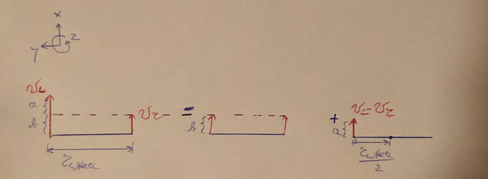

The purpose of this github page is to document my progress throughout the project. In the future I also want this github page to serve as a guide for other people to build their own robot, so some of the text is written in this 'how to do stuff' way.

# Table of Contents
* [Introduction](#introduction)
* [Software used](#software-used)
* [Hardware used](#hardware-used)
  * [Parts](#parts)
* [Robot design](#robot-design)
* [Installing the software](#installing-the-software)
* [Communication between RPI and Arduino](#communication-between-rpi-and-arduino)
* [Controlling the motors](#controlling-the-motors)
  * [Arduino code for controlling the motors](#arduino-code-for-controlling-the-motors)
  * [Testing Arduino code](#testing-arduino-code)
  *  [Launch file](#launch-file)
* [Reading motor encoders](#reading-motor-encoders)
  * [Arduino code for reading motor encoders](#arduino-code-for-reading-motor-encoders)
* [Navigation stack](#navigation-stack)
  * [Calculating the pose from odometry](#calculating-the-pose-from-odometry)  
    * [Python code snippet](#python-code-snippet)  
  * [Calculating the twist from odometry](#calculating-the-twist-from-odometry)
  * [Publishing odometry information](#publishing-odometry-information) 

# Introduction
This project came about because of the COVID-19 pandemic. In normal times I would have had the opportunity to work with the turtlebot3 for one of the courses I am enrolled in.

Since we were not allowed to have hands-on exercise sessions and sending every student a turtlebot3 was not possible, the exercise sessions mainly consisted of completing partially written code in Python. I should note however that the goal of the exercise session was not to learn how to write code for a robot, but to have a firmer grasp on the concepts from the lectures (e.g. the Kalman filter and different path planning algorithms). 

While the exercise sessions succeeded in this area, I was still itching to learn how to write code for a robot and to see this code in action. Throughout the semester I started my research on what was needed to make a turtlebot3-like robot and devised a sort of action plan. After my exams I finally started this project.

Tasks:
- [x] Setting up ROS on rpi and laptop.
- [x] Installing RTABMAP ros.
- [x] Testing RTABMAP ros. 
- [x] Writing code for controlling the motors.
- [x] Testing the code for controlling the motors.
- [x] Writing code to read encoder data.
- [x] Testing reading encoder data code.
- [x] Writing code to calculate pose from the encoder data
- [x] Writing code to publish the pose and twist in a `nav_msgs/Odometry` message format.
- [x] Testing publishing of `nav_msgs/Odometry` message code
- [x] Write code to calculate twist frrom encoder data
- [x] Create static transform between base_link and base_laser (base_laser will be camera_link from freenect).
- [ ] ~~Figure out how to integrate rospy.Rate() into odometry publisher (= odometry_handler.py).~~
      --> needed to use classes to achieve this
- [x] Write code for 'OdometryHandler' class
- [x] Test code for 'OdometryHandler' class
- [x] let arduino continuously publish encoder data
- [x] See if we can run everything we need for gmapping 
- [ ] Configure RTABMAP ROS
- [ ] Testrun

# Software used

 - [Ubuntu 18.04.5 LTS](https://releases.ubuntu.com/18.04/) for the laptop
 - [Ubuntu 18.04.5 LTS server](https://cdimage.ubuntu.com/releases/18.04/release/) (from a preinstalled server image) for the Raspberry Pi
 - [ROS melodic](http://wiki.ros.org/melodic)
 - [Arduino IDE](https://www.arduino.cc/en/software)

# Hardware used

 - A laptop
 - Raspberry Pi 3B+ (from now on referred to as RPI)
 - Arduino Uno Rev3
 - Microsoft xbox 360 Kinect (model 1414) + power adapter
 - Cytron MDD10A DC motor drive
 - Pololu 380:1 micro metal gearmotor HPCB 12V with extended motor shaft
 - Pololu 12CPR magnetic encoder kit
 - Pololu 1/2" metal ball caster
 - Xiaomi 10000 mAh powerbank
 - 12 V battery holder

## Parts

 - Various nuts and bolts
 - Plastic 6mm threaded rod
 - Plasting M6 nuts
 - 3mm and 6mm mdf plates

# Robot design
The design was inspired by the turtlebot3 burger. The robot has three layers. The first layer (on the bottom) is for the two motors with encoders, the battery pack for the motors and the motor drive. The second, middle, layer is for the raspberry pi, the arduino and the battery pack for the arduino as well as for the kinect. The third layer is for the kinect camera itself.

A render of the robot can be seen below. The technical drawings can be found in the `CAD files and technical drawings` folder.


and this is what it currently looks like in real life:


It's not the prettiest of things, but it works for now. I will tidy up the wiring at a later time and maybe I'll also lasercut the mdf plates instead of using the ones I cut myself.


*sources:*
 - *[Arduino](https://grabcad.com/library/arduino-uno-r3-1)*
 - *[Raspberry PI](https://grabcad.com/library/raspberry-pi-3-b-1)*
 - *[Motor](https://www.pololu.com/product/4799/resources)*
 - *[Encoder](https://www.pololu.com/product/4760/resources)*
 - *[Kinect](https://grabcad.com/library/kinect-xbox-360)*
 - *[Motor drive](https://www.cytron.io/p-10amp-5v-30v-dc-motor-driver-2-channels)*
 - *[Metal ball caster](https://www.pololu.com/product/953/resources)*

# Installing the software
Information on how to install the software we will be using can be found in the [wiki](https://github.com/ongaroleandro/autonomous-mobile-robot/wiki/Installing-the-software).
# Communication between RPI and Arduino
We'll use an Arduino to control the motors of our robot. The communication between the RPI and the Arduino will be done with [rosserial](http://wiki.ros.org/rosserial_arduino). Install rosserial on the RPI with:
```bash
sudo apt install ros-melodic-rosserial-arduino
sudo apt install ros-melodic-rosserial
```
To install the library for the Arduino IDE we have two options:

 1. Use the library manager in the Arduino IDE. Search for rosserial and install version 0.7.9. (at the time of writing version 0.9.1 will give an error when compiling)
 2. Let rosserial make the library with `rosrun rosserial_arduino make_libraries.py`. Follow the instructions on the [rosserial ros wiki](http://wiki.ros.org/rosserial_arduino/Tutorials/Arduino%20IDE%20Setup). 

We can test if rosserial is working by using the [Hello World example](http://wiki.ros.org/rosserial_arduino/Tutorials/Hello%20World). 

  * **NB:** To run rosserial we use the command `rosrun rosserial_python serial_node.py /dev/ttyACM0`. The `/dev/ttyACM0` part may be different on your setup. Run `dmesg` in a terminal window while the arduino is connected to the RPI.

*source: [rosserial on the ROS wiki](http://wiki.ros.org/rosserial_arduino)*
# Controlling the motors
The ros topic `/cmd_vel` will receive commands from RTABMAP in the form of `geometry_msgs/Twist` messages. Looking at the [API](http://docs.ros.org/en/jade/api/geometry_msgs/html/msg/Twist.html) we can see that this message consists of two vectors; one for linear velocities and one for angular velocities.
Since our robot can only move in a 2D plane we're only interested in the x and y component of the linear velocity vector and in the z component of the angular velocity vector.
## Arduino code for controlling the motors
See the full code in PATH_TO_CODE. The gist of it is that we subscribe to the `/cmd_vel` topic, convert the `geometry_msgs/Twist` message into a motor speed and then convert this motor speed into a command for our motor drive.
## Testing Arduino code
We'll use [teleop_twist_keyboard](http://wiki.ros.org/teleop_twist_keyboard), which converts key presses into `geometry_msgs/Twist` messages which then get published to the `/cmd_vel` topic.
Install with:
```bash
sudo apt-get install ros-melodic-teleop-twist-keyboard
```
We could test our code by running the following command

 1. Run `roscore`
 2. Run `rosrun rosserial_python serial_node.py /dev/ttyACM0` in a new terminal window.
 3. Run `rosrun teleop_twist_keyboard teleop_twist_keyboard.py` in a new terminal window.

But to make our lives easier we're going to create a launch file. This way we'll only need to enter one command.

## Launch file
The ros wiki has a [great](http://wiki.ros.org/ROS/Tutorials/UsingRqtconsoleRoslaunch#Using_roslaunch) tutorial on making a launch file and luckily it is pretty straightforward. Our launch file will have to launch rosserial and teleop_twist_keyboard. The launch file is located at `ROS/src/testing/src/`.

# Reading motor encoders
The encoder I am using has 12 counts per revolution which is equal to 3 pulses per revolution of the encoder shaft. Since the motor has a 380:1 gearbox, this makes it 1140 pulses per revolution. 

To read the encoders I am using the encoder library from 1988Kramer, you can download the necessary files from [his github](https://github.com/1988kramer/motor_control). We will also need the [TimerOne](https://github.com/PaulStoffregen/TimerOne) library from Paul Stoffregen to get the encoder library to function correctly.

## Arduino code for reading motor encoders
The full code can be found in the Arduino folder of this github. Let's go over the code in detail:
```cpp
#include <TimerOne.h>
#include <Encoder.h>
```
These are the headers we need.
```cpp
const long deltaT = 50000;
```
The `getSpeed` function of the encoder library by 1988Kramer needs to be called every deltaT microseconds, so here we're defining deltaT as 50000 microseconds or 50 miliseconds.

```cpp
Encoder motor_encoderL(2, 4, deltaT, 2280);
Encoder motor_encoderR(3, 5, deltaT, 2280);
```
Here we create our two encoder objects, one for the left encoder and one for the right encoder. The encoder class needs 4 arguments; the pin on the arduino where the A phase of the encoder is connected, the pin on the arduino where the B phase of the encoder is connected, the time between `getSpeed` calls and the number of ticks per revolution.

Pins 2 and 5 have to be used, since the encoder library uses interrupts and these are the only pins on an Arduino UNO which are interrupt pins. For the left encoder I am using pin 2 and pin 3. and for the right encoder I am using pin 3 and 5. In my setup I needed to connect the A phase of the left encoder to pin 2, the B phase of the left encoder to pin 4, the A phase of the right encoder to pin 5 and the B phase of the right encoder to pin 3 to get a postive speed reading from both encoders when the robot is moving forwards.

As stated before, the deltaT defines how frequently we read the speed.

The ticks per revolution caused some headscratching. At first I thought this was just the amount of pulses per revolution, so 1140. This is not the case however because we're using an interrupt which detects a change in voltage of the pin. Since a pulse has a rising edge and a falling edge, there are two changes per pulse, meaning we need to enter 2280 to get a correct speed reading.

```cpp
int Lspeed;
int Rspeed;

void read_motor_encoderL(){
  motor_encoderL.updateCount();
}

void read_motor_encoderR(){
  motor_encoderR.updateCount();
}

void readSpeed(){
  Lspeed = motor_encoderL.getSpeed();
  Rspeed = motor_encoderR.getSpeed();
}
```
`read_motor_encoderL` and `read_motor_encoderR` are the functions we will attach to the interrupts of pin 2 and pin 3.  As the name suggests, the function  `readSpeed` is used to get a speed reading. The `getSpeed` function of the encoder library by 1988Krames gives us the speed in degrees per second.

```cpp
void setup(){
 Timer1.initialize(deltaT);
 Timer1.attachInterrupt(readSpeed);
 attachInterrupt(0, read_motor_encoderL, CHANGE);
 attachInterrupt(1, read_motor_encoderR, CHANGE);
} 
```
With `Timer1.initialize(deltaT)` we create a timer of 50ms and with `Timer1.attachInterrupt(readSpeed)` we say that the function `readSpeed` needs to be executed each time the timer reaches 50ms.

```cpp
void loop(){
 int sec = nh.now().sec % 10000;
 double nsec = nh.now().nsec / 100000;
 double nsec2 = nsec / 10000;
 
 if(Lspeed || Rspeed) {
  array_msg.data[0] = Lspeed;
  array_msg.data[1] = Rspeed;
  array_msg.data[2] = sec + nsec2;
  pub.publish(&array_msg); //publish message
 }
}
```
In our main arduino function we assign the value of Lspeed and Rspeed to the first and second element of our array message. For now we are only publishing our message if one of the motors is turning, this is just to make testing a little easier.

Sending the currect time with the current speed reading is done in a hacky way. Apparantly the number returned by `nh.now().toSect()`is too big for the arduino to handle so we split it up in the most hacky way possible. We take the last four digits of the second part with `nh.now().sec % 10000` and we divide the nanosecond part in two stages (because doing it in one go does not work, for some reason). Then we add them together and assign it to the third element of our array message with `array_msg.data[2] = sec + nsec2`.

# Navigation stack
The navigation stack is essential for our robot since this is what makes our robot mobile. The navigation stack is well documented on the ROS wiki, and there's even a [tutorial](http://wiki.ros.org/navigation/Tutorials/RobotSetup) on how to set up a navigation stack.

Here there is a handy image to give us an idea of the different components of the navigation stack. Note the blue boxes, these are the things we'll need to provide to the navigation stack. The bottom box, base controller, should seem familiar because we already made this part in [Controlling the motors](#controlling-the-motors). 

Our first order of business is to create an odometry source node. We will create a ROS package called `odometry` with the command `catkin_create_pkg odometry geometry_msgs nav_msgs std_msgs tf2 tf2_ros rospy roscpp`. The odometry source node publishes messages on the `odom` topic. This topic contains a `nav_msgs/Odometry` message. 

Looking at the [API](http://docs.ros.org/en/noetic/api/nav_msgs/html/msg/Odometry.html) of this message, we can see that it contains the pose and twist of our robot. The API also states that the pose is with respect to the frame specified in the header, while the twist is with repect to the child frame. According to [REP105](https://www.ros.org/reps/rep-0105.html), the header frame will be the odom frame and the child frame will be the base_link frame. The base_link moves with the robot while the odom frame is a fixed frame. At this point in time we'll assume the origin of the map frame and the origin of the  odom frame coincide and that our robot always starts at the origin of the odom frame.

With these assumptions we can determine the pose from our odometry, i.e. the two wheel encoders. 

We also want to publish at a rate of 10Hz while our arduino sends the encoder data at a much higher rate. We will be using classes to allow us to collect our arduino data and publish our messages at different rates. 

We will make three classes; a `DataProcessor` class which subscribes to our arduino data, a `Publisher` class which publishes messages on the `odom` topic and finally a `OdometryHandler` class which will be used to bring the previous two classes together. Below you can see the UML class diagram.

*NOTE: using classes is not really necessary to publish odometry, you can publish the odometry in the message callback upon receiving the arduino data. The problem with this however is that you'll be continuously calculating the pose from the received arduino and thus wasting CPU power. Doing it this way is easier for testing though and that why I did it like this the first time. You can find the code in `PATH`. More information on that code can be found in the [wiki](https://github.com/ongaroleandro/autonomous-mobile-robot/wiki/Publishing-odometry-without-using-classes).*

![UML_diagram](https://mermaid.ink/img/eyJjb2RlIjoiY2xhc3NEaWFncmFtXG4gICAgT2RvbWV0cnlIYW5kbGVyIDx8LS0gRGF0YVByb2Nlc3NvclxuICAgIE9kb21ldHJ5SGFuZGxlciA8fC0tIFB1Ymxpc2hlclxuICAgIE9kb21ldHJ5SGFuZGxlciA6ICtEYXRhUHJvY2Vzc29yIGFyZHVpbm9fZGF0YV9wcm9jZXNzb3JcbiAgICBPZG9tZXRyeUhhbmRsZXIgOiArUHVibGlzaGVyIHB1YlxuICAgIE9kb21ldHJ5SGFuZGxlcjogK21haW4oKVxuXG4gICAgY2xhc3MgRGF0YVByb2Nlc3NvcntcbiAgICAgICsgdG9waWNfbmFtZSA6IFN0cmluZ1xuICAgICAgKyBzdWIgOiByb3NweVN1YnNjcmliZXJcbiAgICAgICsgcl93aGVlbCA6IGZsb2F0XG4gICAgICArIHdoZWVsX3NlcCA6IGZsb2F0XG4gICAgICArIHhfeV90aGV0YV90IDogYXJyYXlcbiAgICArIHZ4X3Z0aCA6IGFycmF5XG4gICAgKyBhcmR1aW5vX2RhdGEgOiBhcnJheVxuICAgICsgd2wgOiBmbG9hdFxuICAgICsgd3IgOiBmbG9hdFxuICAgICsgdF9hcmQgOiBmbG9hdFxuICAgICsgX19pbml0X18odG9waWNfbmFtZSwgcl93aGVlbCwgd2hlZWxfc2VwKVxuICAgICsgX2NyZWF0ZVN1YnNjcmliZXIoKVxuICAgICsgcHJvY2Vzc0RhdGEobXNnKVxuICAgICsgZXh0cmFjdERhdGEobXNnKVxuICAgICsgY2FsY1Bvc2VUd2lzdCh3bCwgd3IsIHRfYXJkKVxuICAgICsgZ2V0QnJvYWRjYXN0ZXJJbmZvKClcbiAgICArIGdldFB1Ymxpc2hlckluZm8oKVxuXG4gICAgfVxuICAgIGNsYXNzIFB1Ymxpc2hlcntcbiAgICArIHRvcGljX25hbWUgOiBTdHJpbmdcbiAgICAgICsgZnJhbWVfaWQgOiBTdHJpbmdcbiAgICArIGNoaWxkX2ZyYW1lX2lkIDogU3RyaW5nXG4gICAgKyBvZG9tX3B1YiA6IHJvc3B5UHVibGlzaGVyXG4gICAgKyBvZG9tX2Jyb2FkY2FzdGVyIDogcm9zcHlCcm9hZGNhc3RlclxuICAgIC0gX19pbml0X18odG9waWNfbmFtZSwgZnJhbWVfaWQsIGNoaWxkX2ZyYW1lX2lkKVxuICAgICsgZ2V0Q3VycmVudFRpbWUoKVxuICAgICsgY3JlYXRlVEYoY3VycmVudF90aW1lLCB4X3lfdGhldGFfdClcbiAgICArIGNyZWF0ZU5hdk1zZyhjdXJyZW50X3RpbWUsIHhfeV90aGV0YV90LCB2eF92dGgpXG4gICAgKyBwdWJsaXNoTWVzc2FnZShvZG9tLCBvZG9tX3RyYW5zKVxuICAgIH1cbiAgICAgICAgICAgICIsIm1lcm1haWQiOnsidGhlbWUiOiJkZWZhdWx0In0sInVwZGF0ZUVkaXRvciI6ZmFsc2UsImF1dG9TeW5jIjp0cnVlLCJ1cGRhdGVEaWFncmFtIjpmYWxzZX0)

The code for the different classes can be found in `ROS/src/odometry/src`. More details on how these classes work can be found in the section `NAME`. In the next paragraph I will explain how we can calculate the pose of our robot from the odometry data.

## Calculating the pose from odometry
The [pose](http://docs.ros.org/en/noetic/api/geometry_msgs/html/msg/Pose.html) contains our position and orientation in free space. Our robot is restricted to a single plane, the XY plane, so the pose of our robot is the x- and y-position with respect to the origin and the angle with respect to the x-axis.

The kinematics of a 2 wheel differential drive robot are well known. [This](https://www.hmc.edu/lair/ARW/ARW-Lecture01-Odometry.pdf) lecture by Chris Clark gives us the equations we need and also explains the derivation of them step by step. 
The equations are:


### Python code snippet
The calculation of the pose will be done in the `DataProcessor` class. A numpy array is created when a `DataProcessor` object is created. It is a 1x4 array called `x_y_theta_t`. This array stores the latest published x- and y- position and the angle θ as well as the time of publishing in seconds. More information on the time can be found in the section `reading motor encoder`.
When the array is first created however, it is `[0, 0, 0, 0]` since we assumed our robot starts at the origin of the odom frame. 

Two important variables get also created when we initialise the class, namely the radius of our wheels `r_wheel` and the distance between our wheel `wheel_sep`.

With that as background knowledge it will be easier to understand the full code for doing the calculation:
```python
def calcPoseTwist(self, wl, wr, t_ard):
		if ((self.x_y_theta_t == [0, 0, 0, 0]).all()):
			self.x_y_theta_t = np.array([0, 0, 0, t_ard])

		delta_theta = (- wl * self.r_wheel * (t_ard - self.x_y_theta_t[3]) + wr * self.r_wheel * (t_ard - self.x_y_theta_t[3])) / self.wheel_sep
		delta_s = (wl * self.r_wheel * (t_ard - self.x_y_theta_t[3]) + wr * self.r_wheel * (t_ard - self.x_y_theta_t[3])) * 0.5
		
		x = self.x_y_theta_t[0] + delta_s * np.cos(self.x_y_theta_t[2] * np.pi / 180 + delta_theta * 0.5)		
		y = self.x_y_theta_t[1] + delta_s * np.sin(self.x_y_theta_t[2] * np.pi / 180 + delta_theta * 0.5)
		theta = self.x_y_theta_t[2] + delta_theta * 180 / np.pi  # FIX ME: theta needs to stay between -359 and +359 degrees
		
		self.x_y_theta_t = np.array([x, y, theta, t_ard])
```

The original equations are given in terms of distance, while our encoders give a speed. Luckily we can easily convert a speed to a distance by multiplying our speed with a Δt.  Let's look at the code in more detail:

```python
def calcPoseTwist(self, wl, wr, t_ard):
  if ((self.x_y_theta_t == [0, 0, 0, 0]).all()):
    self.x_y_theta_t = np.array([0, 0, 0, t_ard])
```

The if statement is there because the time contained in the message we receive is not the seconds elapsed since starting the node. The time we receive is the current time in seconds by using `nh.now()`, see the section on reading the motor encoders for more details. Without the if statement the first Δt we calculate would be enormous and incorrect.

```python
delta_theta = (- wl * self.r_wheel * (t_ard - self.x_y_theta_t[3]) + wr * self.r_wheel * (t_ard - self.x_y_theta_t[3])) / self.wheel_sep
delta_s = (wl * self.r_wheel * (t_ard - self.x_y_theta_t[3]) + wr * self.r_wheel * (t_ard - self.x_y_theta_t[3])) * 0.5
```
Here we calculate Δθ and Δs. As stated before, the distance traveled is our linear velocity multiplied with a Δt. Δt is our current time minus the previous time. Our current time is in the message and our previous time is in the array x_y_theta_t. We get our previous time in the list by writing `x_y_theta_t[3]` 

```python
x = self.x_y_theta_t[0] + delta_s * np.cos(self.x_y_theta_t[2] * np.pi / 180 + delta_theta * 0.5)		
y = self.x_y_theta_t[1] + delta_s * np.sin(self.x_y_theta_t[2] * np.pi / 180 + delta_theta * 0.5)
theta = self.x_y_theta_t[2] + delta_theta * 180 / np.pi  # FIX ME: theta needs to stay between -359 and +359 degrees
```
Now that we have Δθ and Δs we can calculate , x, y and θ.
`np.cos()` and `np.sin()` need the angle in radians. The Δθ we calculated earlier is in radians, but for easy reading we will store our angle θ in degrees in our array x_y_theta_t.  This means we need to convert the θ from our array to radians. 
*NOTE: we know the Δθ we calculated earlier is in radians because when looking at the derivation of the equations you can see that they used s=rθ to get the distance traveled, which is only valid for a θ in radians.*

```python
self.x_y_theta_t = np.array([x, y, theta, t_ard])
```

Finally we store the new x-position, y-position, θ and the time in our array x_y_theta_t.

## Calculating the twist from odometry
Apart from the pose we also need the twist of our robot. The twist is the linear velocity in the x-direction vx and the angular velocity in the z-direction vt. The twist is with respect to the base_link frame, i.e. the frame attached to our robot.

Aside from the array `x_y_theta_t`, which gets initialised when a `DataProcessor` object is created, the array `vx_vth` also gets created. This array stores the latest linear and angular velocity which has been published.

```python
if (wl > 0 and wr > 0):
  if (wl > wr):
    self.vx_vth[0] = wr * self.r_wheel
  else:
    self.vx_vth[0] = wl * self.r_wheel
  self.vx_vth[1] = -self.r_wheel * (wl - wr) / (0.5 * self.wheel_sep)
elif (wl < 0 and wr < 0):
  if (wl < wr):
    self.vx_vth[0] = wr*self.r_wheel
  else:
    self.vx_vth[0] = wl*self.r_wheel
  self.vx_vth[1] = -self.r_wheel * (wl - wr) / (0.5 * self.wheel_sep)
else:
  self.vx_vth[0] = 0
  self.vx_vth[1] = self.r_wheel * wr / (0.5 * self.wheel_sep)
```
Our robot is either going forwards, going backward or rotating in place. The if statement is to calculate the linear and angular velocity when it is going forwards. The elif statement is for when it is going backwards and the else statement is for when it is rotating in place.

```python
if (wl > wr):
  self.vx_vth[0] = wr * self.r_wheel
else:
  self.vx_vth[0] = wl * self.r_wheel
self.vx_vth[1] = -self.r_wheel * (wl - wr) / (0.5 * self.wheel_sep)
```
Inside the if statement we check if the left wheel is rotating faster than the right wheel. If it is, our linear velocity is determined by the speed of the right wheel. The reason for this can be explained by looking at the velocity vectors in this situation:



Here we can also see that when the left wheel is moving faster, it will make our robot rotate in the clockwise direction about the z-axis. This is, according to the convention used and as seen in the upper lefthand corner, a negative rotation about the z-axis.

## Publishing odometry information
Publishing the pose and twist as well as the necessary transforms is fairly straightforward using this [tutorial](http://wiki.ros.org/navigation/Tutorials/RobotSetup/Odom#Using_tf_to_Publish_an_Odometry_transform) from the ROS wiki. This tutorial gives us the code written in C++, so we'll need to convert it to Python code.

Line 9 in the code of the code in the tutorial tells us that need to create a publisher object, here  named `odom_pub`, which publishes a `nav_msgs/Odometry` message on the topic called `odom`. 
Line 10 tells us that we also need a transform broadcaster.

More details on how to create a publisher node in Python can be found [here](http://wiki.ros.org/ROS/Tutorials/WritingPublisherSubscriber%28python%29) and how to create a transform broadcaster can be found [here](http://wiki.ros.org/tf2/Tutorials/Writing%20a%20tf2%20broadcaster%20%28Python%29). 

Publishing will be handled by the `Publisher` class. When we initialise this class we will create a ROS publisher named `odom_pub` and a tf2 broadcaster named `odom_broadcaster`. The `Publisher` class also contains two functions: `createTF` to create the message for the broadcaster and `createNavMsg` to create the message for the ROS publisher.

The code is pretty self explanatory and can found [here](https://github.com/ongaroleandro/autonomous-mobile-robot/blob/main/ROS/src/odometry/src/publisher.py). The only thing I'll explain here is the addition modules we need to import.

```python
    import tf2_ros
    import tf_conversions
    import geometry_msgs.msg
    from nav_msgs.msg import Odometry
```
  - `tf2_ros` is needed to create the transform broadcaster
  - `tf_conversions` is needed to convert our orientation from a pitch, yaw, roll reprensation to a quaternion representation.
  - The `geometry_msgs.msg` module contains the TranformStamped class which is used by the broadcaster.
  - The odometry class is located in the `nav_msgs.msg` module.
